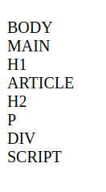

# Coding challenge!

Create a HTML file using this as the body (don't fix the bugs!):

```html
    <main>
        <h1>Cool website</h1>
        <article>
            <h2>Only...</h2>
            <p>This element is broken
        </article>
    </main>
    <div id="output">
```

- Create a function called `printr` that takes in an element
- `printr` should console.log the element tag name
- `printr` should then iterate the children that element
- For each child, call the `printr` function
- Finally, call `printr(document.body)` tostart the printing

## DIFFICULT BONUS CHALLENGE

Make printr show its output in `#output` instead of the console. Hint: you might want to collect the elments in and an array and create the elements for them separately.



To challenge yourself **even more**, make the results indented!

